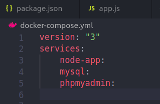
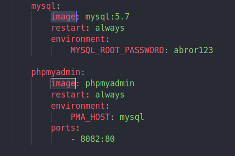
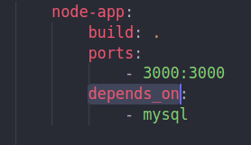
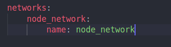
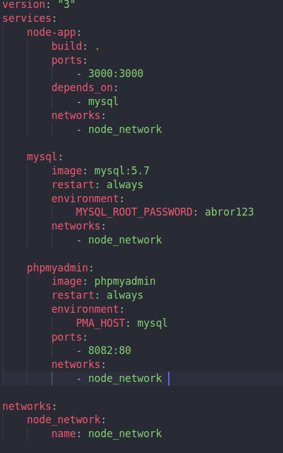
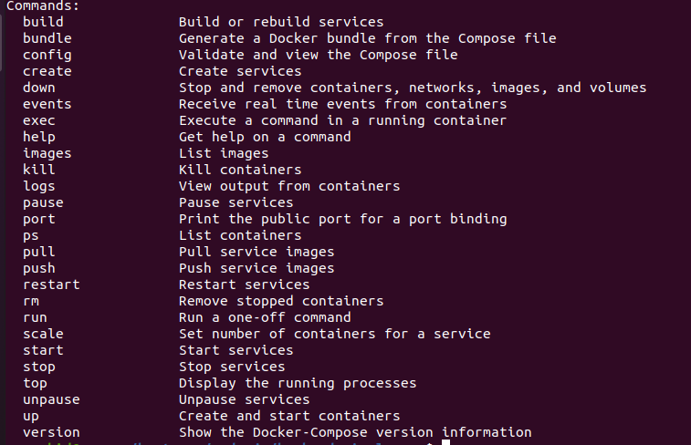
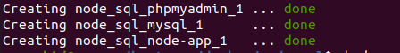
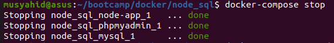

# Menggunakan Docker Compose

Pada kenyataannya mungkin kita mempunyai banyak container yang harus kita integrasikan. Jika kita membuat satu - satu seperti membuat image, container dan network satu persatu tentunya akan memakan waktu dan tenaga yang banyak. Pada docker ada suatu fitur yang disebut dengan docker compose. Yang memungkinkan kita membuat container, image dan network dalam satu file. Nantinya hanya perlu menjalankan satu perintah untuk otomatis menjalankan semuanya

- Buat sebuah file dengan nama docker-compose.yml (default name)
- Didalam file docker-compose.yml, Buat version dari docker-compose
- Selanjutnya. Buat container - container dan set pada atribut services

        
- Berikut merupakan container - container yang dibutuhkan

- Kemudian pada container mysql dan phpmyadmin, ambil masing - masing image yang sudah disediakan dari docker hub
- Isikan port mysql dan phpmyadmin dan isikan environment seperti root password DLL
- Pada container node-app ada yang disebut dengan atribut depends_on. Artinya container ini membutuhkan container lain untuk jalan. Karena container node-app ini membutuhkan mysql, maka depends_on kita masukkan mysql

- Pada docker-compose juga dapat membuat network.

- Setelah network dibuat, Kemudian set setiap container dengan menambahkan atribut networks dan isikan dengan nama network yang telah dibuat agar container - container tersebut dapat terhubung

- Kemudian jalankan docker-compose untuk melihat perintah apa saja yang dapat digunakan

- Disini perintah yang akan kita gunakan untuk menjalankan sekaligus membuat containernya dalah "docker-compose up"
- Kemudian untuk melakukan stop dan mengapus container, network, images dan volume kita dapat menggunakan "docker-compose down"
- Jika hanya ingin melakukan stop dan tidak menghapus container yang sudah dibuat, kita cukup menggunakan perintah "docker-compose stop"

- Kemudian jika kita jalankan perintah "dokcer-compose up" dia akan menjalankan dan membuat container

- Kemudian jika kita jalankan perintah "dokcer-compose stop" dia akan menstop  container

- SELESAI. Terima Kasih
